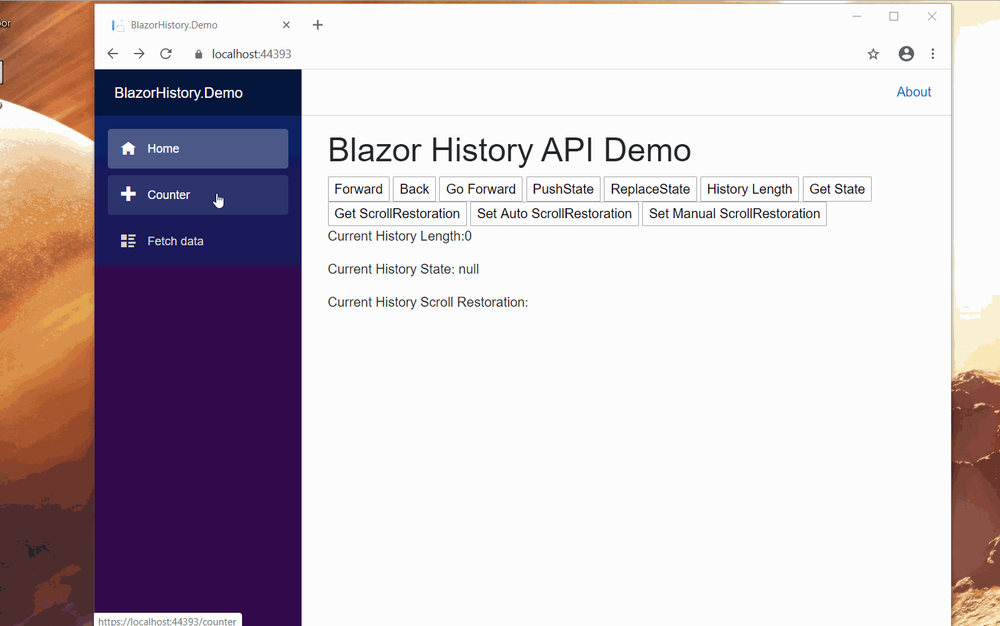

# BlazorHistory

    	
	

HTML5 History API for Blazor without any JavaScript Library Dependency.

This package wraps [HTML5 History](https://developer.mozilla.org/en-US/docs/Web/API/History) APIs. 

## Installation

`Install-Package BlazorHistory -Version 1.0.0`

## Register the service in your services method

`services.AddBlazorHistory();`

## No javascript library reference dependency

This library has no javascript library reference dependency.

## Usage

`[Inject] IBlazorHistory BlazorHistory { get; set; }`

### BlazorHistory Methods

<table>
	<tr>
		<th>BlazorHistory</th>
		<th>Method</th>
	</tr>
	<tr>
		<td>Goes to the previous page in session history</td>
		<td>Back()</td>
	</tr>
	<tr>
		<td>Goes to the next page in session history</td>
		<td>Forward()</td>
	</tr>
	<tr>
		<td>Loads a page from the session history by index</td>
		<td>Go(int index)</td>
	</tr>
    <tr>
		<td>Pushes the given data onto the session history stack</td>
		<td>PushState<T>(T stateData, string pageTitle, string url)</td>
	</tr>
    <tr>
		<td>Updates the most recent entry on the history stack</td>
		<td>ReplaceState<T>(T stateData, string pageTitle, string url)</td>
	</tr>
    <tr>
		<td>Returns an Integer representing the number of elements in the session history, including the currently loaded page</td>
		<td>Length()</td>
	</tr>
    <tr>
		<td>Allows web applications to explicitly set default scroll restoration behavior on history navigation. This property can be either auto or manual.</td>
		<td>ScrollRestoration(ScrollRestorationType scrollRestorationType)</td>
	</tr>
    <tr>
		<td>Allows web applications to explicitly get default scroll restoration behavior on history navigation. This property can be either auto or manual.</td>
		<td>ScrollRestoration()</td>
	</tr>
    <tr>
		<td>Returns a T type representing the state at the top of the history stack</td>
		<td>State<T>()</td>
	</tr>
</table>

## License
MIT
